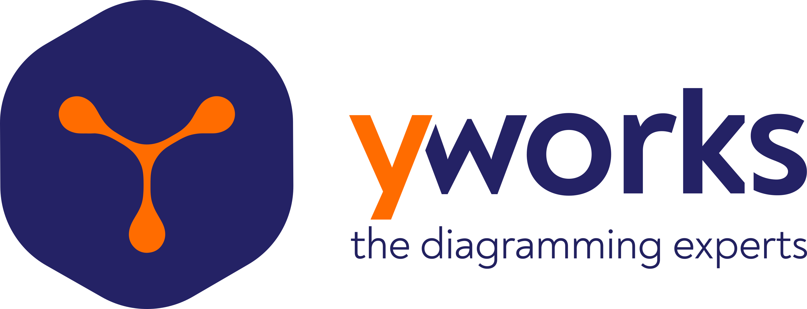
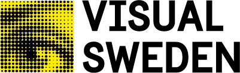
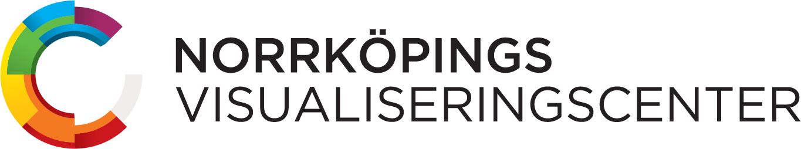

## August 19-21, 2026 · Ontario, Canada

<!--
**Registration is now open** \\
[Register Now](/gd2025/pages/registration/#registration-instructions) • [View Fees](/gd2025/pages/registration/#registration-fees) • [Travel & Stay](/gd2025/pages/travel_accommodation/)
-->

## About Graph Drawing 2026

Graph Drawing is concerned with the geometric representation of graphs and constitutes the algorithmic core of Network Visualization. Graph Drawing and Network Visualization are motivated by applications where it is crucial to visually analyze and interact with relational datasets. Examples of such application areas include data science, social sciences, Web computing, information systems, biology, geography, business intelligence, information security and software engineering.
{: style="text-align: justify;"}

The symposium on Graph Drawing and Network Visualization has been the main annual event in this area for more than 30 years. Its focus is on combinatorial and algorithmic aspects of graph drawing as well as the design of network visualization systems and interfaces.
{: style="text-align: justify;"}

## Important Dates

TBA
<!--
| Events                            | Dates                 |
| --------------------------------- | --------------------- |
| Abstract submission deadline      | ~~June 3, 2025~~          |
| Paper submission deadline         | ~~June 10, 2025~~         |
| Notification of paper acceptance  | ~~July 23, 2025~~         |
| Poster submission deadline        | ~~August 22, 2025~~       |
| Notification of poster acceptance | September 1, 2025     |
| Final paper versions due          | September 1, 2025     |
| PhD school                        | September 22–23, 2025 |
| Symposium                         | September 24–26, 2025 |

All deadlines are understood to be 23:59 AoE.

## Sponsors

### Platinum Sponsor

<table style="border-collapse: collapse; border: none;">
  <tr style="border: none;">
    <td style="border: none;">
       
      <a href="https://www.carltryggersstiftelse.se/this-is-the-carl-trygger-foundation/" target="_blank" style="padding-top: 10px; display: inline-block;"><strong class="sponsers-text" style="font-size: 1.2em;">Carl Tryggers Foundation for Scientific Research</strong></a>
    </td>
  </tr>
</table>

### Gold Sponsors

<table style="border-collapse: collapse; border: none;">
  <tr style="border: none;">
    <td style="border: none;"> 
    <a href="https://www.yworks.com/?utm_campaign=gd25&utm_medium=wesite" target="_blank"  style="padding-top: 10px; display: inline-block;"> <strong class="sponsers-text" style="font-size: 1.2em;">yWorks</strong></a> </td>
    <td style="border: none;"></td>
    <td style="border: none;"></td>
    <td style="border: none;"> 
    <a href="https://www.tomsawyer.com" target="_blank" style="padding-top: 10px; display: inline-block;"><strong class="sponsers-text" style="font-size: 1.2em;">Tom Sawyer Software</strong></a>
    </td>
  </tr>
</table>

### Silver Sponsor

<table style="border-collapse: collapse; border: none;">
  <tr style="border: none;">
    <td style="border: none;">
       
      <a href="https://www.visualsweden.se/" target="_blank" style="padding-top: 10px; display: inline-block;"><strong class="sponsers-text" style="font-size: 1.1em;">Visual Sweden</strong></a>
    </td>
  </tr>
</table>

### Contributors

<table style="border-collapse: collapse; border: none;">
  <tr style="border: none;">
    <td style="border: none;">
       
      <a href="https://visualiseringscenter.se/" target="_blank" style="padding-top: 10px; display: inline-block;"><strong class="sponsers-text" style="font-size: 1.0em;">Visualiseringscenter C</strong></a>
    </td>
    <td style="border: none;"></td>
    <td style="border: none;">
       
      <a href="https://liu.se/en" target="_blank" style="padding-top: 10px; display: inline-block;"><strong class="sponsers-text" style="font-size: 1.0em;">Linköping University</strong></a>
    </td>
  </tr>
</table>
-->